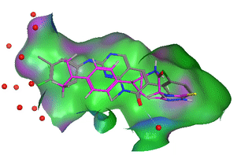

# RiFF (working repo)
so far theres just these 3 scripts, i have alot more stuff in jupyter notebooks in need to test and merge in
## fragments
i have fragments categorized per functional group in the folder fragments
## fragcombine
the main script, heres an example usage
```
python3 fragcombine.py --i dock_amines.sdf dock_acids.sdf --angle_cutoff 0.9 --coord_cutoff 0.1
```
here's the result, combined fragments in cyan:

## dock frags
this is just a handy script for running dockstring jobs. the example data in example_data was generated using
```
python3 dock_frags.py --input fragments/c_1000.csv --target ABL1 --output example_data/c_abl1_dock.sdf
python3 dock_frags.py --input fragments/a_1000.csv --target ABL1 --output example_data/a_abl1_dock.sdf
```
## pharmacophore embed
still need to think whats the best way to 1. provide ph4s with exlpicit coords, probably a moe like file, 2. how to choose splits or do them exhaustively
